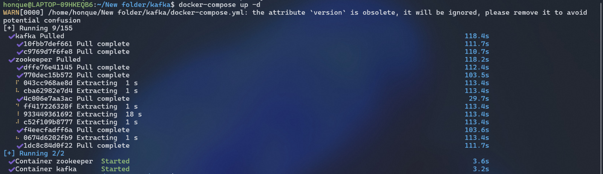
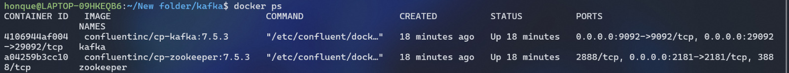
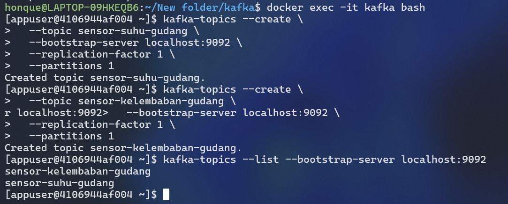
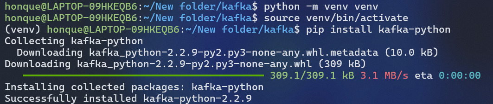
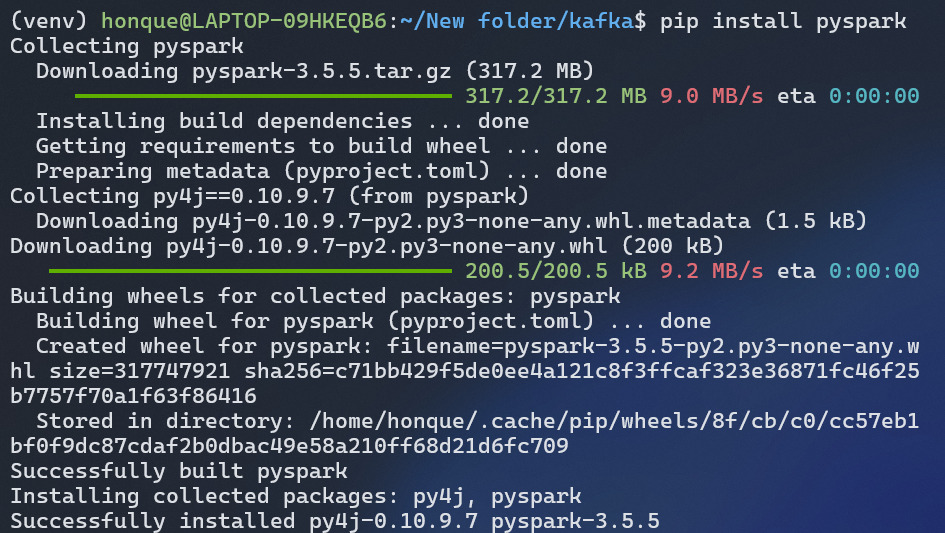
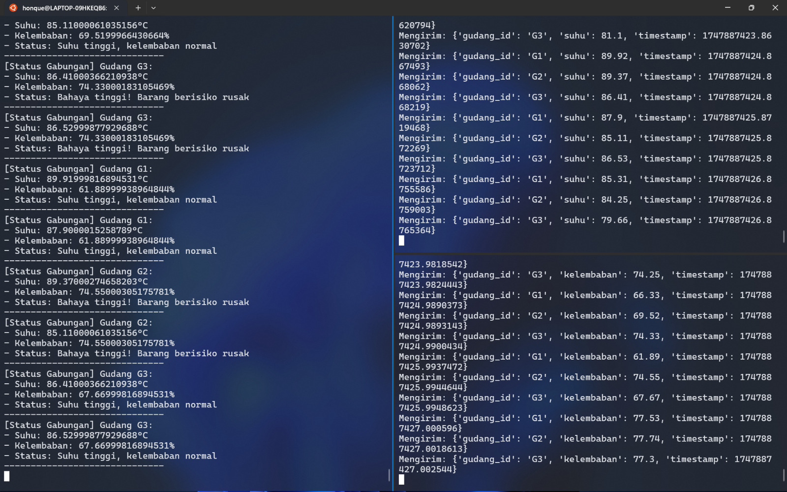

# Proyek Problem Based Learning: Pemantauan Gudang Real-time dengan Apache Kafka dan PySpark

## 🎯 Latar Belakang Masalah

Sebuah perusahaan logistik mengelola gudang penyimpanan barang sensitif (makanan, obat-obatan, elektronik). Untuk menjaga kualitas, gudang dilengkapi sensor suhu dan kelembaban yang mengirim data setiap detik. Perusahaan ingin memantau kondisi gudang secara *real-time* untuk mencegah kerusakan barang akibat suhu terlalu tinggi atau kelembaban berlebih.

## 🎓 Tujuan Pembelajaran

*   Memahami cara kerja Apache Kafka dalam pengolahan data *real-time*.
*   Membuat Kafka Producer dan Consumer untuk simulasi data sensor.
*   Mengimplementasikan *stream filtering* dengan PySpark.
*   Melakukan *join multi-stream* dan analisis gabungan dari berbagai sensor.
*   Mencetak hasil analitik berbasis kondisi kritis gudang ke dalam *output console*.

## 🛠️ Alat dan Teknologi yang Digunakan

*   **Docker & Docker Compose:** Untuk menjalankan Apache Kafka dan Zookeeper dalam kontainer.
*   **Apache Kafka:** Sebagai *message broker* untuk menangani aliran data sensor.
*   **Python:** Bahasa pemrograman untuk membuat Kafka Producer.
    *   `kafka-python`: Library Python untuk berinteraksi dengan Kafka.
*   **Apache Spark (PySpark):** Untuk memproses dan menganalisis data stream dari Kafka.
    *   `pyspark`: Library Python untuk Spark.

## 🚀 Langkah-Langkah Implementasi

### 1. Setup Apache Kafka dan Zookeeper dengan Docker

Kita memulai dengan menyiapkan infrastruktur Kafka menggunakan Docker Compose. Ini memudahkan kita untuk menjalankan Kafka dan Zookeeper tanpa perlu instalasi manual.

**a. Buat file `docker-compose.yml`:**

```yaml
services:
  zookeeper:
    image: confluentinc/cp-zookeeper:7.5.3
    container_name: zookeeper
    ports:
      - "2181:2181"
    environment:
      ZOOKEEPER_CLIENT_PORT: 2181
      ZOOKEEPER_TICK_TIME: 2000

  kafka:
    image: confluentinc/cp-kafka:7.5.3
    container_name: kafka
    ports:
      - "9092:9092"
      - "29092:29092"
    depends_on:
      - zookeeper
    environment:
      KAFKA_BROKER_ID: 1
      KAFKA_ZOOKEEPER_CONNECT: 'zookeeper:2181'
      KAFKA_LISTENER_SECURITY_PROTOCOL_MAP: PLAINTEXT:PLAINTEXT,PLAINTEXT_HOST:PLAINTEXT
      KAFKA_ADVERTISED_LISTENERS: PLAINTEXT://kafka:9092,PLAINTEXT_HOST://localhost:29092
      KAFKA_OFFSETS_TOPIC_REPLICATION_FACTOR: 1
      KAFKA_GROUP_INITIAL_REBALANCE_DELAY_MS: 0
      KAFKA_CONFLUENT_LICENSE_TOPIC_REPLICATION_FACTOR: 1
      KAFKA_CONFLUENT_BALANCER_TOPIC_REPLICATION_FACTOR: 1
      KAFKA_TRANSACTION_STATE_LOG_MIN_ISR: 1
      KAFKA_TRANSACTION_STATE_LOG_REPLICATION_FACTOR: 1
```

**b. Jalankan kontainer Docker:**
Buka terminal di direktori tempat Anda menyimpan `docker-compose.yml`, lalu jalankan:

```bash
docker-compose up -d
```

*Ilustrasi:*


*Ilustrasi:*


### 2. Buat Topik Kafka

Selanjutnya, kita membuat dua topik Kafka yang akan digunakan untuk menerima data dari sensor suhu dan sensor kelembaban.

**a. Masuk ke dalam kontainer Kafka:**

```bash
docker exec -it kafka bash
```

**b. Buat topik `sensor-suhu-gudang` dan `sensor-kelembaban-gudang`:**

```bash
kafka-topics --create \
  --topic sensor-suhu-gudang \
  --bootstrap-server localhost:9092 \
  --replication-factor 1 \
  --partitions 1

kafka-topics --create \
  --topic sensor-kelembaban-gudang \
  --bootstrap-server localhost:9092 \
  --replication-factor 1 \
  --partitions 1
```

**c. Verifikasi daftar topik:**

```bash
kafka-topics --list --bootstrap-server localhost:9092
```
Setelah selesai, ketik `exit` untuk keluar dari kontainer.

*Ilustrasi:*


### 3. Setup Lingkungan Python dan Install Dependensi

Kita akan menggunakan Python untuk membuat producer data sensor dan PySpark untuk consumer. Sebaiknya gunakan *virtual environment*.

**a. Buat dan aktifkan virtual environment (opsional tapi direkomendasikan):**

```bash
python -m venv venv
source venv/bin/activate 
```

**b. Install library yang dibutuhkan:**

```bash
pip install kafka-python pyspark
```

*Ilustrasi:*



### 4. Simulasikan Data Sensor (Producer Kafka)

Dua script Python akan dibuat untuk mengirim data suhu dan kelembaban secara terpisah ke topik Kafka masing-masing.

**a. `producer_suhu.py`:**

```python
import json
import time
import random
from kafka import KafkaProducer

producer = KafkaProducer(
    bootstrap_servers='localhost:29092',
    value_serializer=lambda v: json.dumps(v).encode('utf-8')
)

topic_name = 'sensor-suhu-gudang'
gudang_ids = ["G1", "G2", "G3"]

print(f"Mengirim data suhu ke topik: {topic_name}")

try:
    while True:
        for gudang_id in gudang_ids:
            suhu = round(random.uniform(70, 90), 2)
            data = {
                "gudang_id": gudang_id,
                "suhu": suhu,
                "timestamp": time.time()
            }
            print(f"Mengirim: {data}")
            producer.send(topic_name, value=data)
        producer.flush()
        time.sleep(1)
except KeyboardInterrupt:
    print("Pengiriman dihentikan.")
finally:
    producer.close()
    print("Producer suhu ditutup.")
```

**b. `producer_kelembaban.py`:**

```python
import json
import time
import random
from kafka import KafkaProducer

producer = KafkaProducer(
    bootstrap_servers='localhost:29092',
    value_serializer=lambda v: json.dumps(v).encode('utf-8')
)

topic_name = 'sensor-kelembaban-gudang'
gudang_ids = ["G1", "G2", "G3"]

print(f"Mengirim data kelembaban ke topik: {topic_name}")

try:
    while True:
        for gudang_id in gudang_ids:
            kelembaban = round(random.uniform(60, 80), 2)
            data = {
                "gudang_id": gudang_id,
                "kelembaban": kelembaban,
                "timestamp": time.time()
            }
            print(f"Mengirim: {data}")
            producer.send(topic_name, value=data)
        producer.flush()
        time.sleep(1)
except KeyboardInterrupt:
    print("Pengiriman dihentikan.")
finally:
    producer.close()
    print("Producer kelembaban ditutup.")
```

**Penjelasan Kode Producer:**
*   `KafkaProducer(bootstrap_servers='localhost:29092', ...)`: Menghubungkan producer ke Kafka broker yang berjalan di Docker dan diekspos ke port `29092` di host machine.
*   `value_serializer=lambda v: json.dumps(v).encode('utf-8')`: Mengonversi data dictionary Python menjadi format JSON string, lalu di-encode ke bytes sebelum dikirim ke Kafka.
*   `time.time()`: Menghasilkan timestamp UNIX (jumlah detik sejak epoch), yang akan digunakan untuk operasi windowing di PySpark.
*   `producer.send(topic_name, value=data)`: Mengirim data ke topik Kafka yang ditentukan.
*   `time.sleep(1)`: Memberi jeda 1 detik antar pengiriman batch data untuk semua gudang.

**c. Jalankan Producer:**
Buka dua terminal terpisah.
Di terminal pertama: `python producer_suhu.py`
Di terminal kedua: `python producer_kelembaban.py`

### 5. Konsumsi dan Olah Data dengan PySpark

Script PySpark akan membaca data dari kedua topik Kafka, melakukan filtering, menggabungkan stream, dan menampilkan peringatan.

**`pyspark_consumer.py`:**

```python
from pyspark.sql import SparkSession
from pyspark.sql.functions import from_json, col, expr, from_unixtime
from pyspark.sql.types import StructType, StructField, StringType, FloatType, TimestampType
import time

def create_spark_session():
    return SparkSession.builder \
        .appName("KafkaSparkStreamingPeringatanGudang") \
        .config("spark.jars.packages", "org.apache.spark:spark-sql-kafka-0-10_2.12:3.2.0") \
        .config("spark.sql.streaming.forceDeleteTempCheckpointLocation", "true") \
        .config("spark.sql.shuffle.partitions", "1") \
        .getOrCreate()

def safe_float_compare(value, threshold):
    if value is None:
        return False
    return value > threshold

def process_streams():
    spark = create_spark_session()
    spark.sparkContext.setLogLevel("WARN")

    try:
        kafka_bootstrap_servers = "localhost:29092"
        
        schema_suhu = StructType([
            StructField("gudang_id", StringType(), True),
            StructField("suhu", FloatType(), True),
            StructField("timestamp", FloatType(), True)
        ])

        schema_kelembaban = StructType([
            StructField("gudang_id", StringType(), True),
            StructField("kelembaban", FloatType(), True),
            StructField("timestamp", FloatType(), True)
        ])

        df_suhu = spark.readStream \
            .format("kafka") \
            .option("kafka.bootstrap.servers", kafka_bootstrap_servers) \
            .option("subscribe", "sensor-suhu-gudang") \
            .option("startingOffsets", "latest") \
            .option("failOnDataLoss", "false") \
            .load() \
            .selectExpr("CAST(value AS STRING) as json_string") \
            .select(from_json(col("json_string"), schema_suhu).alias("data")) \
            .select(
                col("data.gudang_id").alias("gudang_id"),
                col("data.suhu"),
                from_unixtime(col("data.timestamp")).cast(TimestampType()).alias("timestamp")
            )

        df_kelembaban = spark.readStream \
            .format("kafka") \
            .option("kafka.bootstrap.servers", kafka_bootstrap_servers) \
            .option("subscribe", "sensor-kelembaban-gudang") \
            .option("startingOffsets", "latest") \
            .option("failOnDataLoss", "false") \
            .load() \
            .selectExpr("CAST(value AS STRING) as json_string") \
            .select(from_json(col("json_string"), schema_kelembaban).alias("data")) \
            .select(
                col("data.gudang_id").alias("gudang_id"),
                col("data.kelembaban"),
                from_unixtime(col("data.timestamp")).cast(TimestampType()).alias("timestamp")
            )

        def process_suhu_batch(batch_df, batch_id):
            try:
                for row in batch_df.collect():
                    if safe_float_compare(row.suhu, 80):
                        print(f"[Peringatan Suhu Tinggi] Gudang {row.gudang_id}: Suhu {row.suhu}°C - {row.timestamp}")
            except Exception as e:
                print(f"Error processing temperature batch: {e}")

        def process_kelembaban_batch(batch_df, batch_id):
            try:
                for row in batch_df.collect():
                    if safe_float_compare(row.kelembaban, 70):
                        print(f"[Peringatan Kelembaban Tinggi] Gudang {row.gudang_id}: Kelembaban {row.kelembaban}% - {row.timestamp}")
            except Exception as e:
                print(f"Error processing humidity batch: {e}")

        query_suhu = df_suhu \
            .writeStream \
            .outputMode("append") \
            .foreachBatch(process_suhu_batch) \
            .trigger(processingTime="2 seconds") \
            .option("checkpointLocation", "/tmp/checkpoint_suhu") \
            .start()

        query_kelembaban = df_kelembaban \
            .writeStream \
            .outputMode("append") \
            .foreachBatch(process_kelembaban_batch) \
            .trigger(processingTime="2 seconds") \
            .option("checkpointLocation", "/tmp/checkpoint_kelembaban") \
            .start()

        df_suhu_wm = df_suhu.withWatermark("timestamp", "15 seconds")
        df_kelembaban_wm = df_kelembaban.withWatermark("timestamp", "15 seconds")

        join_condition = (df_suhu_wm["gudang_id"] == df_kelembaban_wm["gudang_id"]) & \
                         (df_suhu_wm["timestamp"] >= (df_kelembaban_wm["timestamp"] - expr("INTERVAL 10 SECONDS"))) & \
                         (df_suhu_wm["timestamp"] <= (df_kelembaban_wm["timestamp"] + expr("INTERVAL 10 SECONDS")))

        joined_df = df_suhu_wm.join(df_kelembaban_wm, join_condition, "inner") \
            .select(
                df_suhu_wm["gudang_id"],
                df_suhu_wm["suhu"],
                df_kelembaban_wm["kelembaban"],
                df_suhu_wm["timestamp"].alias("event_time")
            )

        def process_joined_batch(batch_df, batch_id):
            try:
                for row in batch_df.collect():
                    if row.suhu is None or row.kelembaban is None:
                        continue
                        
                    status = "Aman"
                    if safe_float_compare(row.suhu, 80) and safe_float_compare(row.kelembaban, 70):
                        status = "Bahaya tinggi! Barang berisiko rusak"
                    elif safe_float_compare(row.suhu, 80):
                        status = "Suhu tinggi, kelembaban normal"
                    elif safe_float_compare(row.kelembaban, 70):
                        status = "Kelembaban tinggi, suhu aman"
                    
                    print(f"[Status Gabungan] Gudang {row.gudang_id}:")
                    print(f"- Suhu: {row.suhu}°C")
                    print(f"- Kelembaban: {row.kelembaban}%")
                    print(f"- Status: {status}")
                    print("-" * 30)
            except Exception as e:
                print(f"Error processing joined batch: {e}")

        query_gabungan = joined_df \
            .writeStream \
            .outputMode("append") \
            .foreachBatch(process_joined_batch) \
            .trigger(processingTime="2 seconds") \
            .option("checkpointLocation", "/tmp/checkpoint_gabungan") \
            .start()

        print("Streaming started. Waiting for data...")
        
        while True:
            time.sleep(5)
            if not all(q.isActive for q in [query_suhu, query_kelembaban, query_gabungan]):
                print("One or more queries have terminated unexpectedly")
                break

    except Exception as e:
        print(f"Error in streaming application: {e}")
    finally:
        print("Stopping all streaming queries...")
        for q in spark.streams.active:
            q.stop()
        spark.stop()
        print("Spark session stopped.")

if __name__ == "__main__":
    process_streams()
```

**Penjelasan Kode PySpark Consumer:**
*   **`create_spark_session()`**: Menginisialisasi SparkSession.
    *   `config("spark.jars.packages", ...)`: Menyertakan package yang dibutuhkan Spark untuk berinteraksi dengan Kafka. Pastikan versi `org.apache.spark:spark-sql-kafka-0-10_2.12:X.Y.Z` sesuai dengan versi Spark yang Anda gunakan.
*   **Skema Data**: `schema_suhu` dan `schema_kelembaban` mendefinisikan struktur data JSON yang diterima dari Kafka. `timestamp` awalnya dibaca sebagai `FloatType` (karena `time.time()` menghasilkan float).
*   **Membaca Stream dari Kafka**:
    *   `spark.readStream.format("kafka")...load()`: Membaca data dari topik Kafka secara streaming.
    *   `.selectExpr("CAST(value AS STRING) as json_string")`: Mengambil kolom `value` dari Kafka (yang berisi data pesan dalam bentuk binary) dan meng-cast nya ke string.
    *   `.select(from_json(col("json_string"), schema_suhu).alias("data"))`: Mem-parsing string JSON menjadi kolom-kolom terstruktur berdasarkan skema yang diberikan.
    *   `.select(..., from_unixtime(col("data.timestamp")).cast(TimestampType()).alias("timestamp_suhu"))`: Mengonversi kolom `timestamp` (yang merupakan float detik UNIX) menjadi tipe data `TimestampType` yang dapat digunakan Spark untuk operasi windowing dan watermark. Kolom `gudang_id` juga di-alias untuk menghindari ambiguitas saat join.
*   **Peringatan Individual**: `process_suhu_batch` dan `process_kelembaban_batch` dipanggil untuk setiap *micro-batch* data dari stream suhu dan kelembaban. Fungsi ini melakukan filter sederhana dan mencetak peringatan jika suhu > 80°C atau kelembaban > 70%.
*   **Watermark**: `withWatermark("timestamp_suhu", "15 seconds")` memberitahu Spark seberapa lama data bisa terlambat tiba sebelum dianggap usang untuk operasi stateful seperti join. Ini penting untuk menangani data yang mungkin datang tidak berurutan (*out-of-order data*).
*   **Join Stream**:
    *   `joined_df = df_suhu_wm.join(df_kelembaban_wm, join_condition, "inner")`: Menggabungkan stream suhu dan kelembaban.
    *   `join_condition`: Kondisi untuk join adalah `gudang_id` harus sama, dan `timestamp` dari kedua sensor harus berada dalam rentang waktu 10 detik satu sama lain. Ini memastikan kita membandingkan pembacaan sensor yang terjadi pada waktu yang berdekatan untuk gudang yang sama.
*   **Peringatan Gabungan**: `process_joined_batch` memproses data yang telah di-join. Fungsi ini menentukan status gudang (Aman, Bahaya Tinggi, Suhu Tinggi, Kelembaban Tinggi) berdasarkan nilai suhu dan kelembaban gabungan.
*   **Output**: `.writeStream.outputMode("append").foreachBatch(...).start()` memulai query streaming dan mencetak hasilnya ke konsol.
    *   `trigger(processingTime="X seconds")`: Mengontrol seberapa sering micro-batch diproses.
    *   `checkpointLocation`: Diperlukan oleh Spark Streaming untuk menyimpan state antar batch.
*   **Loop `while True` dan `awaitAnyTermination()`**: Menjaga aplikasi tetap berjalan untuk terus memproses data stream.

**b. Jalankan PySpark Consumer:**
Buka terminal baru (pastikan Kafka, Zookeeper, dan kedua producer masih berjalan):

```bash
spark-submit --packages org.apache.spark:spark-sql-kafka-0-10_2.12:3.2.0 pyspark_consumer.py
```

### 6. Amati Hasilnya

Anda akan melihat output dari producer yang mengirim data, dan output dari PySpark consumer yang menampilkan:
1.  Peringatan suhu tinggi individual.
2.  Peringatan kelembaban tinggi individual.
3.  Status gabungan untuk setiap gudang, termasuk peringatan kritis jika suhu dan kelembaban sama-sama tinggi.

*Ilustrasi:*

